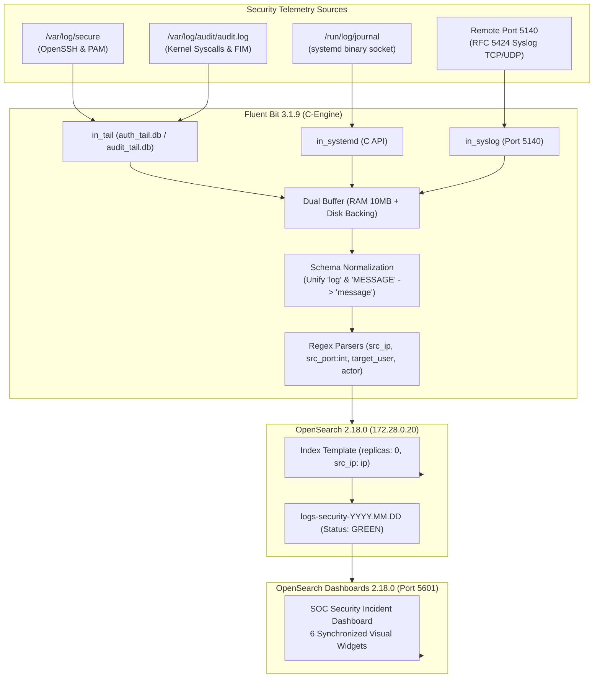

# Hardened Open-Source SIEM Architecture (Subject 21)


An enterprise-grade, fault-tolerant log processing and security analytics architecture built on a hardened **Red Hat Enterprise Linux 9.6** platform using **Docker Compose**. 

The pipeline ingests, normalizes, indexes, and visualizes security telemetry across four distinct sources (host authentication, kernel `auditd`, binary `systemd-journald`, and remote RFC 5424 syslog), protected by host-level defense-in-depth (**SELinux Enforcing**, **firewalld** zone segmentation, **CIS OpenSSH**, and kernel **auditd** privilege escalation rules).

---

## Architecture Overview



---

## Key Features

1. **Decoupled Stream Pipeline**: Ingestion and normalization handled by **Fluent Bit** in optimized C ($< 40$ MB RAM), eliminating JVM collector overhead.
2. **Schema Normalization**: Solves multi-source field divergence by dynamically unifying `log` (`in_tail`) and `MESSAGE` (`in_systemd`) into a single standard `message` field.
3. **Pristine Cluster Health (GREEN)**: Custom index template enforces `"number_of_replicas": 0` and maps `src_ip` as a native `ip` type for mathematical CIDR filtering.
4. **Host Defense-in-Depth**:
   * **SELinux in Enforcing Mode**: Scoped container access (`security_opt: [ "label=disable" ]`) permits Fluent Bit to read `/var/log/audit/audit.log` without disabling global host MAC.
   * **firewalld Segmentation**: Default `drop` zone; SSH and Dashboards isolated to `siem-mgmt` (`10.0.2.1/32`); Syslog isolated to `siem-collector` (`10.0.2.0/24`). Includes mitigation for the Docker nftables chain reload flush.
   * **CIS OpenSSH Hardening**: Modular drop-in enforcing `MaxSessions 10` (CIS 5.2.19), `PermitRootLogin no`, and modern elliptic-curve crypto (`curve25519-sha256`, `chacha20-poly1305`).
   * **Linux Kernel auditd**: Intercepts `execve` syscalls (`euid=0`, `auid>=1000`) with immutable forensic caller attribution (`AUID="taher"` vs `UID="intruder"`).
5. **Infrastructure-as-Code (IaC)**: Complete 6-widget SOC dashboard exported as `configs/dashboards/soc-dashboard.ndjson` for 1-click restoration.

---

## 3-Minute Quickstart

### Prerequisites
* RHEL 9.x / Rocky Linux 9 / AlmaLinux 9
* Docker CE & Docker Compose Plugin installed
* Minimum 4 GB RAM allocated

### Step 1: Apply Kernel Tuning
```bash
sudo cp hardening/99-siem-tuning.conf /etc/sysctl.d/
sudo sysctl --system
```

### Step 2: Start the Containers
```bash
# Build storage directories with correct permissions
mkdir -p storage/opensearch-data storage/fluent-bit-buffer
sudo chown -R 1000:1000 storage/opensearch-data

# Launch OpenSearch and Dashboards
docker compose up -d opensearch opensearch-dashboards

# Wait 25 seconds for OpenSearch bootstrap, then push index template
docker exec -i siem-opensearch curl -s -X PUT "http://127.0.0.1:9200/_index_template/security_logs_template" \
  -H "Content-Type: application/json" -d @- < configs/opensearch/index-template.json

# Start Fluent Bit collector
docker compose up -d fluent-bit
docker compose ps
```

### Step 3: Apply Host Hardening
```bash
# Apply firewall segmentation
chmod +x hardening/setup-firewall.sh && ./hardening/setup-firewall.sh

# Apply CIS OpenSSH hardening
sudo cp hardening/01-cis-hardening.conf /etc/ssh/sshd_config.d/
sudo sshd -t && sudo systemctl restart sshd

# Load kernel audit rules
sudo cp hardening/99-privesc.rules /etc/audit/rules.d/
sudo augenrules --load
```

### Step 4: Restore the SOC Dashboard (1-Click)
Access OpenSearch Dashboards at `http://localhost:5601`, or restore programmatically via curl:
```bash
curl -X POST "http://localhost:5601/api/saved_objects/_import?createNewCopies=false" \
  -H "osd-xsrf: true" \
  --form file=@configs/dashboards/soc-dashboard.ndjson
```

---

## SOC Incident Dashboard

The dashboard provides a unified security command center across 6 synchronized widgets:

```
┌───────────────────────────────────┬───────────────────────────────────┐
│     Top Attacker IPs (Donut)      │   Top Targeted Accounts (Bar)     │
│   10.0.2.3 (Kali) vs 10.0.2.1     │      admin, root, devops...       │
├─────────────────┬─────────────────┼───────────────────────────────────┤
│ SSH Attack Ctr  │ PrivEsc Violat. │    Telemetry by Layer (Donut)     │
│  Metric: 134    │    Metric: 80   │ host.auth, host.audit, remote...  │
├─────────────────┴─────────────────┴───────────────────────────────────┤
│            Unified Live Security Incident Stream (Table)              │
│ Time | message | target_user | routing_tag | src_ip | actor | audit_key │
└───────────────────────────────────────────────────────────────────────┘
```

---

## Verified Attack Telemetry (MITRE ATT&CK)

* **T1110.001 (Automated SSH Brute Force)**: Tested from Kali Linux via Hydra. Correlated 100+ separate TCP connections under single attacker profile `src_ip: 10.0.2.3`.
* **T1548.003 (Privilege Escalation)**: Tested with unprivileged user `intruder`. Kernel `auditd` intercepted `execve` syscalls and preserved immutable caller attribution (`AUID="taher"` with `UID="intruder"`).
* **Remote Syslog Ingestion (RFC 5424)**: High-speed 50-event burst transmitted over TCP port 5140 with zero packet loss under `routing_tag: remote.syslog`.

---

## Repository Structure

```
.
├── .gitignore                         # Prevents database binary and buffer commits
├── README.md                          # Open-source showcase & setup documentation
├── docker-compose.yml                 # Multi-container orchestration specification
├── configs/
│   ├── fluent-bit/
│   │   ├── fluent-bit.conf            # Stream ingestion, normalization & output
│   │   └── parsers.conf               # Regex tokenizers with integer casting
│   ├── opensearch/
│   │   └── index-template.json        # Zero-replica template with native IP mapping
│   └── dashboards/
│       └── soc-dashboard.ndjson       # Exported 6-widget SOC incident dashboard
├── hardening/                         # Host defense-in-depth configurations
│   ├── 99-siem-tuning.conf            # Kernel sysctl parameters
│   ├── 01-cis-hardening.conf          # OpenSSH CIS benchmark configuration
│   ├── 99-privesc.rules               # Linux kernel auditd rules
│   └── setup-firewall.sh              # Automated firewalld zone script
└── docs/                              # Academic & Technical Deliverables
    ├── technical-report.md            # Comprehensive academic technical report
    ├── presentation-defense.md        # 5-minute timed oral defense script & Q&A
    └── architecture-plan.md           # Master architecture implementation plan
```

---

## Academic Information

* **Subject**: Subject 21 — Mise en place d'une architecture de traitement des événements de sécurité (LOG)
* **Class**: CII-5-J-SSIRF-H
* **Author**: BORGI Mohamed Taher
* **License**: Apache License 2.0
