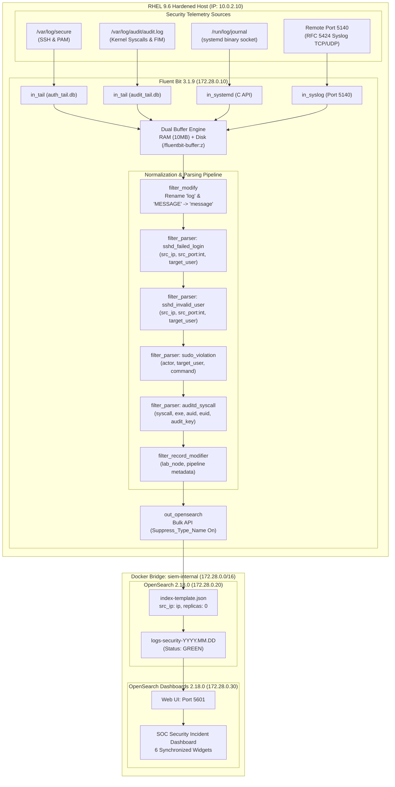

# Master Implementation Plan: Hardened Open-Source Log Processing Architecture (RHEL 9.6)

## Project Overview & Objectives
This document is the definitive master implementation plan for the project.

The project implements and defends a fault-tolerant, open-source Security Information and Event Management (SIEM) pipeline on a hardened Red Hat Enterprise Linux 9.6 host using Docker Compose. The architecture ingests, normalizes, indexes, and visualizes security telemetry across four distinct layers (host authentication, kernel auditd, systemd-journald, and remote RFC 5424 syslog), protected by host-level defense-in-depth (SELinux, firewalld zone segmentation, CIS OpenSSH hardening, and kernel tuning).

---

## Active Lab Environment & Verified Topology

```
[ Management Workstation ] (10.0.2.1 / Host Localhost)
       │  SSH :2222 -> :22 | Web UI :5601 -> :5601
       ▼
[ VirtualBox NAT Network: 10.0.2.0/24 (Gateway: 10.0.2.1) ]
       │                                     
       ├─────────────────────────┐           
       ▼                         ▼           
[ Target: RHEL 9.6 VM ]     [ Docker Bridge: 172.28.0.0/16 ]     [ Attacker: Kali VM ]
IP: 10.0.2.10 (enp0s3)      ├── Fluent Bit (172.28.0.10)          IP: 10.0.2.3 (eth0)
Default Zone: DROP          ├── OpenSearch (172.28.0.20)          Outbound: Hydra,
Firewall: siem-mgmt         └── Dashboards (172.28.0.30)          logger, Nmap
          siem-collector
```

| Entity | Role | Operating System | IP Address & Interface | Exposed Services / Ports |
| :--- | :--- | :--- | :--- | :--- |
| **Defender / Target** | SIEM Server (Docker Compose) | RHEL 9.6 Minimal | `10.0.2.10` (`enp0s3`) | `22/tcp` (CIS SSH), `5601/tcp` (Dashboards), `5140/tcp+udp` (Syslog) |
| **Attacker VM** | Simulated Adversary | Kali Linux 2024.x | `10.0.2.3` (`eth0`) | Outbound Hydra brute-force, RFC 5424 `logger` |
| **Workstation** | SOC Analyst & Antigravity IDE | Windows 11 (24H2) | `10.0.2.1` (`127.0.0.1`) | `2222 -> 10.0.2.10:22`, `5601 -> 10.0.2.10:5601`, `5140 -> 10.0.2.10:5140` |
| **Lab Network** | Isolated Virtual Switch | NAT Network | `10.0.2.0/24` | Gateway: `10.0.2.1`, DHCP: `10.0.2.4 - 10.0.2.254` |

---

## 1. Stack Evaluation & Architectural Defense

### 1.1 Candidate Comparison Matrix

| Evaluation Dimension | Stack A: OpenSearch 2.x + Fluent Bit (Selected) | Stack B: Wazuh Manager + Indexer | Stack C: Elastic Stack (ELK) |
| :--- | :--- | :--- | :--- |
| **Pipeline Transparency** | **High**: Decoupled collector (`Fluent Bit`), storage (`OpenSearch`), and UI (`Dashboards`). Explicit control over parsing pipelines, regex filters, and disk/RAM buffering. | **Low**: Monolithic processing inside `wazuh-analysisd` using static XML decoders/rules. Bypasses standard stream processing concepts. | **Medium**: Logstash provides extensive filter plugins but introduces severe JVM overhead. |
| **Footprint / Memory** | **Low-Medium**: Fluent Bit (~30 MB C binary) + OpenSearch (2 GB heap) + Dashboards (~500 MB Node.js) $\approx$ **3 GB total**. Operates smoothly within a 4–6 GB VM. | **High**: Wazuh Manager + Filebeat + Indexer + Dashboard requires **$\ge$ 6–8 GB RAM**; prone to OOM kills on standard student VM allocations. | **High**: Logstash requires 1–2 GB heap by itself; total stack consumes **$\ge$ 6 GB RAM**. |
| **Licensing Integrity** | **100% Open Source (Apache 2.0)**: Strict compliance with open-source project prerequisites. | **GPLv2 / Apache 2.0**: Open source, but indexer is a downstream fork of OpenSearch locked to Wazuh's release cycle. | **Proprietary / SSPL**: Elastic moved away from Apache 2.0 to SSPL/Elastic License, violating pure open-source specifications. |
| **Log Ingestion Flexibility**| Ingests raw `/var/log/audit/audit.log`, systemd journal binary sockets, container stdout, and RFC 5424 syslog streams seamlessly. | Heavily biased toward the Wazuh Agent (`TCP/1514`). Native syslog ingestion requires legacy agentless forwarders or local analysisd decoding. | High ingestion flexibility via Logstash/Beats, but resource-heavy. |
| **Lifecycle & Storage (ISM)**| Native OpenSearch **Index State Management (ISM)** policies automate rollover, hot/warm/cold tiers, and deletion via declarative JSON. | Retains raw archives only via flat files (`archives.json`) or index deletion policies in Filebeat. | Supported via Elasticsearch ILM, but restricted behind SSPL. |

---

## 2. Architectural Implementation

### 2.1 Ingestion & Processing Architecture



### 2.2 Configuration Adjustments & Realities

#### A. Kernel Tuning (`/etc/sysctl.d/99-siem-tuning.conf`)
* `vm.max_map_count=262144`: Required for Lucene memory-mapped index files.
* `vm.swappiness=1`: Minimizes kernel paging of physical memory.
* `net.ipv4.ip_forward=1`: Enables packet routing for container bridges.

#### B. Storage & SELinux Mount Layout
* OpenSearch Data: `./storage/opensearch-data:/usr/share/opensearch/data:z` owned by UID `1000:1000`.
* Fluent Bit Buffer: `./storage/fluent-bit-buffer:/fluentbit-buffer:z` mounted to a dedicated root path. *(Avoids OCI collision with read-only `/var/log:ro`).*
* Fluent Bit Container Security: `security_opt: [ "label=disable" ]` allows reading `/var/log/audit/audit.log` (`auditd_log_t`) without disabling global host SELinux.

#### C. OpenSearch Index Template (`index-template.json`)
* `"number_of_replicas": 0`: Eliminates unassigned replica warnings in a single-node cluster, turning cluster health **GREEN**.
* `"src_ip": { "type": "ip" }`: Maps IP addresses natively for CIDR aggregation and range searching.
* `"target_user": { "type": "keyword" }`: Prevents text analysis tokenization, enabling accurate terms aggregation.

#### D. OpenSSH CIS Hardening (`/etc/ssh/sshd_config.d/01-cis-hardening.conf`)
* `PermitRootLogin no`: Direct mitigation of MITRE T1078.
* `MaxSessions 10`: Set to 10 (per CIS 5.2.19) to prevent Antigravity IDE multiplexed channel disconnection while enforcing session bounding.
* `MaxAuthTries 6`: Limits brute-force velocity per TCP connection.
* `PasswordAuthentication yes`: Kept enabled for controlled laboratory credential testing.
* Cryptographic Suite: Restricted to `curve25519-sha256` key exchange and `chacha20-poly1305@openssh.com` ciphers.

#### E. firewalld Network Segmentation
* Default Zone: `drop` (silently drops unapproved packets).
* Zone `siem-mgmt` (Source `10.0.2.1/32`): Allows `ssh` (22) and `5601/tcp` (Dashboards) strictly to Windows workstation.
* Zone `siem-collector` (Source `10.0.2.0/24`): Allows `5140/tcp` and `5140/udp` (Syslog) for network shippers.
* **Operational Rule**: Any `firewall-cmd --reload` flushes Docker's `DOCKER` nftables chains; must immediately be followed by `sudo systemctl restart docker`.

#### F. Linux auditd Privilege Escalation Rules (`/etc/audit/rules.d/99-privesc.rules`)
* Intercepts 64-bit and 32-bit `execve` system calls where `euid=0` and `auid>=1000`, tagged with `key="priv_esc_exec"`.
* File watches on `/etc/sudoers` (`key="sudoers_modification"`).
* File watches on `/etc/shadow`, `/etc/passwd`, `/etc/group` (`key="shadow_modification"`, `user_db_modification`, `group_db_modification`).

---

## 3. SOC Security Incident Dashboard (Expanded Architecture)

The dashboard has been expanded into a **6-Widget Full-Spectrum SOC Console**:

| Widget | Visualization Type | Query / DQL Filter | Configuration & Aggregation | Purpose |
| :--- | :--- | :--- | :--- | :--- |
| **1. Top Attacker IPs** | Donut Chart | `routing_tag: "host.auth" AND src_ip: *` | Terms on `src_ip`, Size: 5 | Visualizes external attack origin (`10.0.2.3` vs `10.0.2.1`). |
| **2. Top Targeted Accounts** | Horizontal Bar | `routing_tag: "host.auth" AND target_user: *` | Terms on `target_user`, Size: 10 | Identifies brute-forced usernames (`admin`, `root`, `service`). |
| **3. SSH Attack Counter** | Metric Tile | `routing_tag: "host.auth" AND message: "Failed password*"` | Metric: `Count` | Deduplicated 1:1 counter for failed login attempts. |
| **4. PrivEsc Violations** | Metric Tile | `actor: * OR audit_key: "priv_esc_exec"` | Metric: `Count` | Real-time counter for local sudo violations and privilege escalation. |
| **5. Telemetry by Layer** | Donut Chart | `*` | Terms on `routing_tag`, Size: 5 | Shows event distribution: `host.auth`, `host.audit`, `host.journal`, `remote.syslog`. |
| **6. Live Incident Stream** | Saved Search Table | `src_ip: * OR actor: * OR audit_key: *` | Columns: `Time`, `routing_tag`, `src_ip`, `actor`, `target_user`, `audit_key`, `message` | Unified incident stream displaying both external and internal attacks. |

> [!TIP]
> **Dashboard Portability (IaC)**: The complete dashboard, all 6 visualizations, and the `logs-security-*` index pattern are exported as `configs/dashboards/soc-dashboard.ndjson`. This guarantees 1-click or 1-curl automated restoration on any fresh installation.

---

## 4. Offensive Testing & Technical Validation

### 4.1 Scenario 1: Automated SSH Brute Force (MITRE ATT&CK T1110.001)

#### Execution
1. Proved perimeter firewall defense: Kali (`10.0.2.3`) connection to port 22 timed out under default `drop` zone.
2. Temporarily opened port 22 in `siem-collector`: `sudo firewall-cmd --zone=siem-collector --add-service=ssh`.
3. Executed Hydra dictionary attack from Kali:
   ```bash
   hydra -L <(printf "root\nadmin\nservice\ndevops\nintruder\n") \
         -P <(printf "123456\npassword\nadmin123\nsecret\n") \
         -t 4 -vV ssh://10.0.2.10
   ```
4. Closed temporary rule: `sudo firewall-cmd --zone=siem-collector --remove-service=ssh`.

#### Forensic Findings & Justification
* **Socket Multiplexing**: Log inspection revealed Hydra opened dozens of distinct TCP sockets (`port 58264`, `port 56046`, `port 58252`, etc.) with unique `sshd` PIDs. OpenSSH `MaxAuthTries` rate-limits single connections, but cannot stop multi-socket distributed attacks.
* **SIEM Correlation**: Fluent Bit ingested each connection event, and OpenSearch correlated all distinct ports into a single attacker profile (`src_ip: 10.0.2.3`), driving the **Top Attacker IPs** donut and **Total Attack Counter** up in real time.
* **Client Prompt Behavior**: Manual login (`ssh taher@10.0.2.10`) stopped after 3 attempts due to the client-side `NumberOfPasswordPrompts 3` parameter.

---

### 4.2 Scenario 2: Unauthorized Privilege Escalation & FIM (MITRE ATT&CK T1548.003)

#### Execution
1. Created unprivileged test user:
   ```bash
   sudo useradd -m -s /bin/bash intruder
   sudo passwd intruder
   ```
2. Logged into `intruder` shell and executed unauthorized commands:
   ```bash
   su - intruder
   sudo -l
   sudo cat /etc/shadow
   exit
   ```
3. Removed test account: `sudo userdel -r intruder`.

#### Forensic Findings & Justification
* **Sudo Violation Extraction**: Fluent Bit's `sudo_violation` parser extracted:
  * `actor`: `intruder`
  * `target_user`: `root`
  * `message`: Captured `/bin/cat /etc/shadow` from `/var/log/secure`.
* **Kernel Syscall Forensic Immutability**:
  * `type=SYSCALL ... exe="/usr/bin/sudo" key="priv_esc_exec"`
  * `UID="intruder"` (1001), `EUID="root"` (0)
  * **`AUID="taher"` (1000)**: Proved that switching users via `su` does not erase the immutable login UID recorded by the kernel.
* **File Integrity Monitoring (FIM)**: `99-privesc.rules` caught identity modifications when accounts were created/modified:
  * `key="user_db_modification"` on `/etc/passwd` (`syscall=257` `openat`, `syscall=82` `rename`).
  * `key="shadow_modification"` on `/etc/shadow`.
  * `key="group_db_modification"` on `/etc/group`.

---

### 4.3 Scenario 3: Remote Syslog Ingestion & Stress Test (RFC 5424 over Port 5140)

#### Execution
1. Ingested individual firewall alert from Kali:
   ```bash
   logger --rfc5424 --server 10.0.2.10 --port 5140 --tcp -t "palo-alto-fw" "THREAT: Outbound C2 beaconing to 198.51.100.45 blocked"
   ```
2. Ingested 50-event high-speed burst loop from Kali:
   ```bash
   for i in $(seq 1 50); do
     logger --rfc5424 --server 10.0.2.10 --port 5140 --tcp -t "suricata-ids" "SIG: Potential SQL Injection attack pattern detected event_id=$i"
   done
   ```

#### Forensic Findings & Justification
* **Zero Packet Loss**: All 50 burst events were ingested by Fluent Bit over TCP 5140, parsed by `syslog_rfc5424`, buffered to disk, and indexed in OpenSearch.
* **Structured RFC Metadata**: Extracted `ident` (`palo-alto-fw`, `suricata-ids`), `host` (`kali`), and indexed under `routing_tag: "remote.syslog"`.
* **Telemetry Distribution**: `remote.syslog` appeared as a distinct slice in the **Telemetry by Layer** donut chart.

